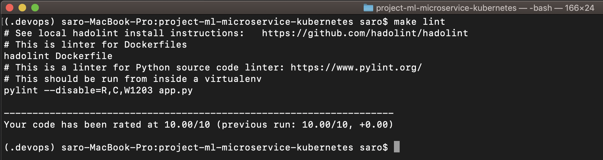

[](https://circleci.com/gh/jalilromrani/Operationalize-a-Machine-Learning-Microservice-API)

## Project Overview

In this project, I apply the skills I have acquired in [Cloud Dev Ops Engineer](https://www.udacity.com/course/cloud-dev-ops-nanodegree--nd9991) program to operationalize a Machine Learning Microservice API. 

I'm given a pre-trained, `sklearn` model that has been trained to predict housing prices in Boston according to several features, such as average rooms in a home and data about highway access, teacher-to-pupil ratios, and so on. You can read more about the data, which was initially taken from Kaggle, on [the data source site](https://www.kaggle.com/c/boston-housing). This project tests my ability to operationalize a Python flask app—in a provided file, `app.py`—that serves out predictions (inference) about housing prices through API calls. This project could be extended to any pre-trained machine learning model, such as those for image recognition and data labeling.

### Project Tasks

The project goal is to operationalize this working, machine learning microservice using [kubernetes](https://kubernetes.io/), which is an open-source system for automating the management of containerized applications. In this project you will:
* Test your project code using linting
* Complete a Dockerfile to containerize this application
* Deploy your containerized application using Docker and make a prediction
* Improve the log statements in the source code for this application
* Configure Kubernetes and create a Kubernetes cluster
* Deploy a container using Kubernetes and make a prediction
* Upload a complete Github repo with CircleCI to indicate that your code has been tested

**The final implementation of the project will showcase your abilities to operationalize production microservices.**

---

## Setup the Environment

* If you haven't already done so, clone the [project repository](https://github.com/jalilromrani/Operationalize-a-Machine-Learning-Microservice-API), and navigate to the project folder.

```
git clone https://github.com/jalilromrani/Operationalize-a-Machine-Learning-Microservice-API.git
cd Operationalize-a-Machine-Learning-Microservice-API
```

* Create a virtualenv and activate it

```
python3 -m venv ~/.devops
source ~/.devops/bin/activate
```

* Run `make install` to install the necessary dependencies

```
make install
```

## Other Libraries
While you still have your .devops environment activated, you will still need to install:
* Docker
* Hadolint
* Kubernetes (Minikube)

### Docker
You will need to use Docker to build and upload a containerized application. If you already have this installed and created a docker account, you may skip this step.

1. You’ll need to [create a free docker account](https://hub.docker.com/signup), where you’ll choose a unique username and link your email to a docker account. **Your username is your unique docker ID.**
2. To install the latest version of docker, choose the Community Edition (CE) for your operating system, [on docker’s installation site](https://docs.docker.com/v17.12/install/). It is also recommended that you install the latest, **stable release.**
3. After installation, you can verify that you’ve successfully installed docker by printing its version in your terminal: `docker --version`

### Run Lint Checks
This project also must pass two lint checks; `hadolint` checks the Dockerfile for errors and `pylint` checks the `app.py` source code for errors.

1. Install `hadolint` following the instructions, [on hadolint's page](https://github.com/hadolint/hadolint):
- **For Mac:**
```
 brew install hadolint
```
- **For Windows:**
```
scoop install hadolint
```
2. In your terminal, type: `make lint` to run lint checks on the project code. If you haven’t changed any code, all requirements should be satisfied, and you should see a printed statement that rates your code (and prints out any additional comments):
```
------------------------------------
Your code has been rated at 10.00/10
```
Your terminal should look something like this:


### Install Minikube
To run a Kubernetes cluster locally, for testing and project purposes, you need the Kubernetes package, Minikube. This operates in a virtual machine and so you'll need to download two things: A virtual machine (aka a hypervisor) then minikube. Thorough installation instructions can be found [here](https://kubernetes.io/docs/tasks/tools/install-minikube/). Here is how I installed minikube:

1. Install VirtualBox
- **For Mac:**
```
brew cask install virtualbox
```
- **For Windows:**
I recommend using a [Windows host](https://www.virtualbox.org/wiki/Downloads).
2. Install minikube:
- **For Mac:**
```
brew cask install minikube
```
- **For Windows:**
I recommend using the [Windows installer](https://kubernetes.io/docs/tasks/tools/install-minikube/).

## Run a Container & Make a Prediction
In order to run a containerized application, you’ll need to build and run the docker image that you defined in the `Dockerfile`, and then you should be able to test your application, locally, by having the containerized application accept some input data and produce a prediction about housing prices. `run_docker.sh`

Next, I open and completed the file, `run_docker.sh` to be able to get Docker running, locally.

### Running the complete script
To run and build a docker image, you’ll type `./run_docker.sh`. After a brief waiting period, you should see messages indicating a successful build, along with some indications that your app is being served on port 80 (also, a warning about the development server is to be expected, here).

```
Successfully built <build id>
Successfully tagged <your tag>
```
This indicates a successful build and **if you keep this application running** you can make predictions!

### Making predictions
Then, to make a prediction, you have to open a **separate tab or terminal window**. In this new window, navigate to the main project directory (some computers will do this automatically) and call `./make_prediction.sh`.

The main terminal should look something like this:


The second terminal should look something like this:


## Upload the Docker Image
Now that you’ve tested your containerized image locally, you’ll want to upload your built image to docker. This will make it accessible to a Kubernets cluster.

### Upload your Docker image
To upload an image to docker, I completed the `upload_docker.sh`.

Assuming you’ve already built the docker image with `./run_docker.sh`, you can now upload the image by calling the complete shell script `./upload_docker.sh`.

Your terminal should look something like this:


If you’ve successfully implemented authentication and tagging, you should see a successful login statement and a repository name that you specified, printed in your terminal. You should also be able to see your image as a repository in your [docker hub account](https://hub.docker.com/).

Your docker hub account should look something like this:


## Configure Kubernetes to Run Locally
You should have a virtual machine like **VirtualBox** and `minikube` installed, as per the project environmet instructions. To start a local cluster, type the terminal command: `minikube start`.

**After minikube starts, a cluster should be running locally.** You can check that you have one cluster running by typing `kubectl config view` where you should see at least one cluster with a `certificate-authority` and `server`.

## Deploy with Kubernetes and Kubernetes Output Logs
Now that you’ve uploaded a docker image and configured Kubernetes so that a cluster is running, you’ll be able to deploy your application on the Kubernetes cluster. This involves running your containerized application using `kubectl`, which is a command line interface for interacting with Kubernetes clusters.

To deploy this application using `kubectl`, I completed the file, `run_kubernetes.sh`. 

After completing the code, call the script `./run_kubernetes.sh`. This assumes you have a local cluster configured and running. This script should create a pod with a name you specify and you may get an initial output with a cluster and status.

Initially, your pod may be in the process of being created, as indicated by
```STATUS: 
ContainerCreating
```
but you just have to wait a few minutes until the pod is ready, then you can run the script again. You can check on your pod’s status with a call to `kubectl get pod` and you should see the status change to **Running**. Then you can run the full `./run_kuberenets.sh` script again.

## Make a prediction
After you’ve called `run_kubernetes.sh`, and a pod is up and running, make a prediction using a separate terminal tab, and a call to `./make_prediction.sh`, as you did before.

The main terminal should look something like this:


The second terminal should look something like this:


## Delete Cluster
After you’re done deploying your containerized application and making test predictions via Kubernetes cluster, you should clean up your resources and **delete the kubernetes cluster** with a call to `minikube delete`.

You can also pause your work and save the cluster state with a call to `minikube stop`.

## Running `app.py`

1. Standalone:  `python app.py`
2. Run in Docker:  `./run_docker.sh`
3. Run in Kubernetes:  `./run_kubernetes.sh`

##### Jalil. R. Omrani